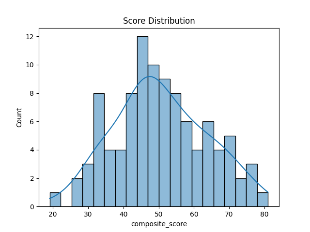
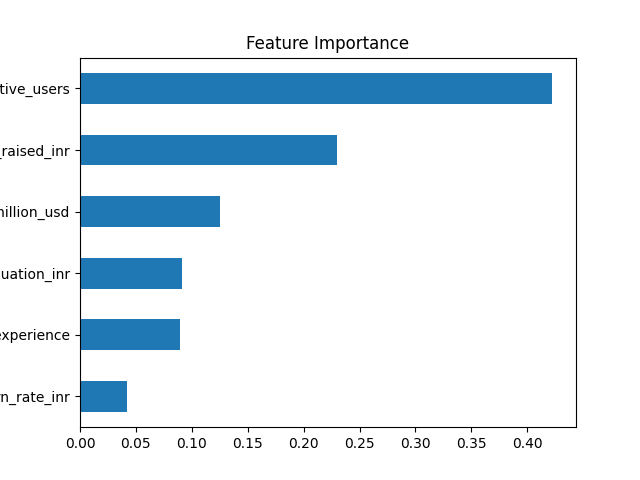
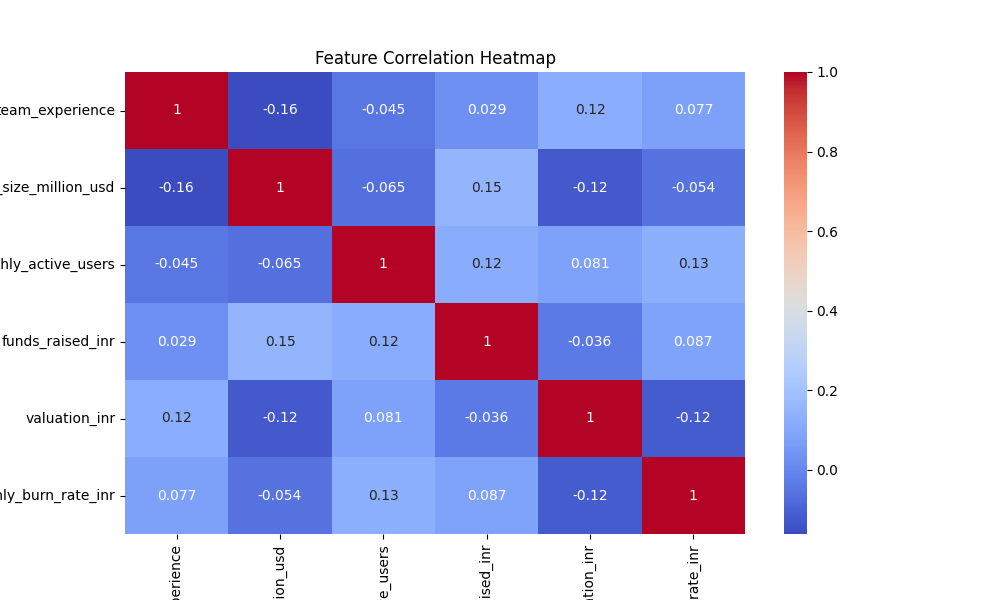

# 🚀 Startup Health Scoring Engine


> A data-driven **Startup Evaluation Engine** — similar to a credit score, but for startups. This project scores and ranks startups out of 100 based on key business indicators like traction, market size, team quality, and financial health using a weighted composite scoring model.

---

## 📌 Problem Statement

Investors and accelerators evaluate hundreds of startups, yet most early-stage assessments remain subjective. This project builds a **quantitative, transparent, and reproducible scoring framework** that evaluates startups across multiple business dimensions — enabling data-driven investment and screening decisions.

---

## 🎯 Objective

- Design a composite scoring model that evaluates startups on 6 key business indicators
- Apply Min-Max normalisation and weighted aggregation to generate a score out of 100
- Rank startups from highest to lowest potential
- Visualise score distributions, feature importance, and correlations to extract actionable insights

---

## ⚖️ Scoring Framework

The health score is a **weighted composite of 6 features**, carefully chosen to reflect real-world startup evaluation criteria:

| Feature | Weight | Reasoning |
|---|---|---|
| `monthly_active_users` | **25%** | Traction is the strongest signal of product-market fit |
| `market_size_million_usd` | **20%** | Large TAM implies scalability and growth potential |
| `team_experience` | **15%** | Experienced founding teams execute better under pressure |
| `funds_raised_inr` | **15%** | Reflects investor confidence and available runway |
| `valuation_inr` | **15%** | Market confidence indicator |
| `monthly_burn_rate_inr` | **10%** | Penalised — leaner startups are more resilient |

### 🔄 Handling Negatively Correlated Metrics

`monthly_burn_rate_inr` is a cost metric — lower is better. Since Min-Max normalisation ordinarily assigns higher scores to higher values, it was **inverted** before aggregation:

```python
df_scaled['monthly_burn_rate_inr'] = 1 - scaler.fit_transform(
    df['monthly_burn_rate_inr'].values.reshape(-1, 1)
)
```

This ensures a startup with a **lower burn rate scores closer to 1**, maintaining consistency with all other positively correlated features.

---

## 📊 Visualisations

The project includes four key charts saved as PNG files:

| Chart | File | Description |
|---|---|---|
| Score Distribution | `score_distribution.png` | Histogram of startup health scores across the dataset |
| Feature Importance | `feature_importance.png` | Relative weight and contribution of each feature |
| Correlation Heatmap | `correlation_heatmap.png` | Inter-feature correlations to detect redundancy |
| Bar Chart | `bar_chart.png` | Top and bottom ranked startups by health score |

### Score Distribution


### Feature Importance


### Correlation Heatmap


---

## 🏆 Key Results

**Top Performer — Startup S004**
- Monthly Active Users: 93K+
- Team Experience: 5+ years
- Large market size and strong funding
- Moderate burn rate — lean and well-funded

**Bottom Performer — Startup S063**
- Very low MAUs despite decent valuation
- Small addressable market
- High burn rate with poor traction — classic danger zone

---

## 💡 Key Insights

- **Burn rate alone doesn't determine rank** — but high burn + low users is a consistently poor combination
- Startups that raised significant funding but showed low traction still ranked poorly, validating that capital ≠ health
- **Market size and user base** are the two features most consistently correlated with high composite scores
- Some high-valuation startups ranked surprisingly low — a signal that market sentiment and fundamentals can diverge

---

## 📂 Dataset

| Property | Detail |
|---|---|
| File | `Startup_Scoring_Dataset.csv` |
| Records | Multiple startup entries (synthetic / simulated) |
| Features | MAUs, Market Size, Team Experience, Funds Raised, Valuation, Burn Rate |
| Target | Composite Health Score (0–100) |

---

## 🛠️ Tech Stack

| Tool | Purpose |
|---|---|
| Python | Core programming language |
| Pandas | Data manipulation and feature engineering |
| NumPy | Numerical operations and normalisation |
| Scikit-learn | Min-Max scaling |
| Matplotlib / Seaborn | Visualisation of scores, heatmaps, and rankings |
| Jupyter Notebook | Interactive analysis environment |

---

## 🚀 Getting Started

### Prerequisites

```bash
pip install pandas numpy matplotlib seaborn scikit-learn jupyter
```

### Run the Notebook

```bash
# Clone the repository
git clone https://github.com/PJ2001-IND/Startup-Health-Scoring.git

# Navigate into the directory
cd Startup-Health-Scoring

# Launch Jupyter
jupyter notebook startup_health_scoring.ipynb
```

---

## 📁 Project Structure

```
📦 Startup-Health-Scoring
 ┣ 📓 startup_health_scoring.ipynb     # Main scoring pipeline and analysis
 ┣ 📄 Startup_Scoring_Dataset.csv      # Input dataset
 ┣ 📊 score_distribution.png           # Score distribution chart
 ┣ 📊 feature_importance.png           # Feature weight visualisation
 ┣ 📊 correlation_heatmap.png          # Feature correlation heatmap
 ┣ 📊 bar_chart.png                    # Top/bottom startup ranking chart
 ┗ 📄 README.md                        # Project documentation
```

---

## 🔭 Future Scope

- Extend the model to include qualitative signals (founder background, product category, social media traction)
- Build an interactive **Streamlit dashboard** where users can input startup data and receive a live score
- Apply **clustering** (K-Means) to group startups into tiers: Promising, Average, At-Risk
- Incorporate real-world startup data from Crunchbase or Tracxn APIs for validation

---

## 👤 Author

**Praasuk Jain**
- GitHub: [@PJ2001-IND](https://github.com/PJ2001-IND)
- LinkedIn: [praasuk-jain](https://www.linkedin.com/in/praasuk-jain-425b6b1a3/)

---

> ⭐ If you found this project useful, consider giving it a star!
